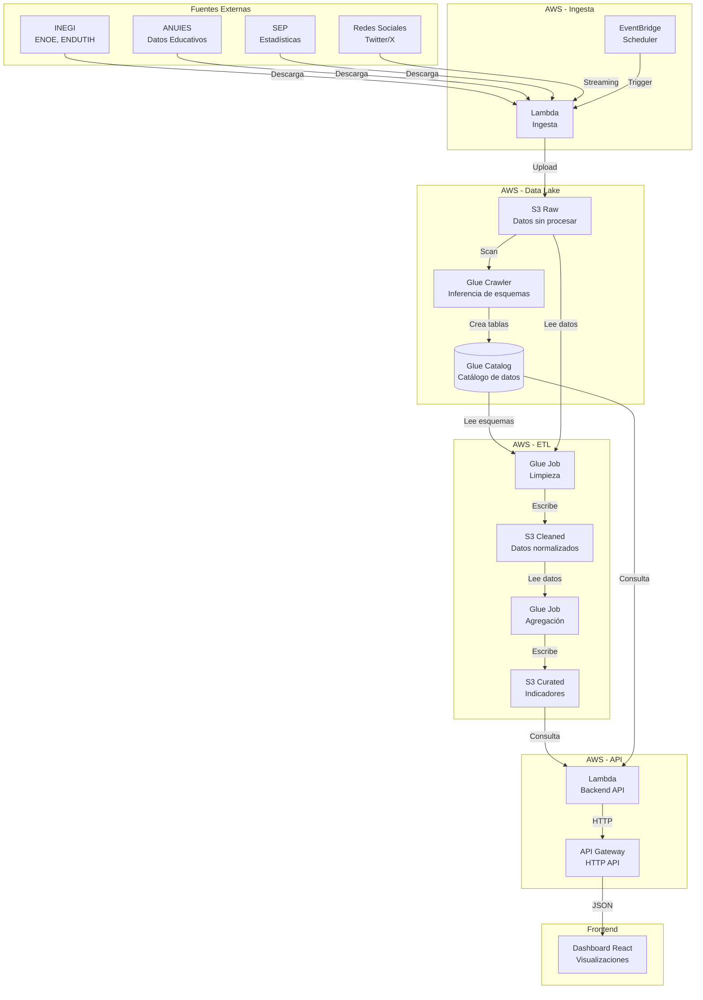

# Plataforma de Datos: AI and Social Change - Youth in Mexico City

## Resumen del Proyecto

Este proyecto implementa una **plataforma de datos y visualización** para el proyecto de investigación "AI and Social Change: A call for Action for and from youth in Mexico City", centrado en el análisis de la juventud y el ecosistema de IA en México.

La plataforma está construida sobre **AWS** utilizando **AWS CDK v2** con **TypeScript**, y proporciona:

- **Data Lake** en S3 con tres zonas de datos (raw, cleaned, curated)
- **Pipelines de ingesta** automatizados para múltiples fuentes de datos (INEGI, ENDUTIH, ANUIES, SEP, etc.)
- **ETL con AWS Glue** para limpieza, normalización y agregación de datos
- **Backend API** (Lambda + API Gateway) para servir datos al frontend
- **Catálogo de datos** con AWS Glue para descubrimiento y consulta

### Variables Clave del Proyecto

La plataforma está diseñada para calcular y almacenar las siguientes variables e indicadores:

1. **Tasa de Desempleo Juvenil (18-30)**: Porcentaje de jóvenes sin empleo (Fuente: INEGI ENOE)
2. **Porcentaje de Jóvenes en Carreras STEM**: Proporción de jóvenes en carreras STEM (Fuente: ANUIES/SEP)
3. **Brecha de Género en STEM**: Diferencia porcentual entre hombres y mujeres en STEM (Fuente: ANUIES/SEP)
4. **Tasa de Subempleo Juvenil**: Jóvenes en empleos de baja calificación (Fuente: INEGI ENOE)
5. **Ingreso Promedio Jóvenes STEM**: Promedio salarial mensual en áreas STEM (Fuente: ENOE/Observatorio Laboral)
6. **Índice de Acceso Digital Juvenil (IADJ)**: Acceso a internet y dispositivos (Fuente: ENDUTIH/INEGI)
7. **Tasa de Adopción de IA Personal**: Uso de herramientas de IA (Fuente: encuestas, Google Trends)
8. **Percepción Positiva vs Negativa sobre IA**: Sentimiento en redes sociales (Fuente: Twitter/X API, modelos de sentimiento)
9. **Índice de Educación y Empleabilidad Digital (IEED)**: Formación tecnológica vs empleo digital (Fuente: ENOE + ANUIES)
10. **Distribución Regional de Talento Tecnológico**: Concentración estatal de talento TIC/STEM (Fuente: ANUIES/INEGI)
11. **Alfabetización Digital Básica**: Habilidades digitales básicas (Fuente: ENDUTIH/OCDE)
12. **Índice de Preparación para la IA (IPA)**: Madurez educativa y digital (Fuente: derivado de indicadores anteriores)
13. **Empleo en Industrias de Alta Tecnología**: Jóvenes en sectores TIC (Fuente: INEGI/IMSS)
14. **Índice de Innovación Juvenil**: Patentes y proyectos liderados por jóvenes (Fuente: IMPI/GitHub)
15. **Brecha Educativa Regional**: Diferencia urbano-rural en logro educativo (Fuente: INEGI/SEP)
16. **Empresas que usan IA (%)**: Porcentaje de empresas que utilizan IA (Fuente: Índice de Desarrollo Digital Estatal)

## Arquitectura

### Descripción General

La arquitectura sigue un patrón de **Data Lake** con tres zonas de datos:

1. **Zona RAW**: Datos sin procesar tal como vienen de las fuentes externas
2. **Zona CLEANED**: Datos normalizados, limpios y en formato optimizado (Parquet)
3. **Zona CURATED**: Datos agregados, indicadores calculados y listos para análisis

### Componentes Principales

- **S3 Buckets**: Almacenamiento de datos en las tres zonas
- **AWS Glue**: Catálogo de datos, crawlers para inferir esquemas, y jobs ETL
- **Lambda Functions**: Ingesta de datos desde fuentes externas y backend API
- **EventBridge**: Orquestación y programación de tareas (cron jobs)
- **API Gateway**: Exposición de endpoints HTTP para el frontend

### Diagrama de Arquitectura



### Flujo de Datos

1. **Ingesta**: EventBridge dispara Lambdas que descargan datos de fuentes externas y los suben a S3 raw
2. **Descubrimiento**: Glue Crawler escanea S3 raw e infiere esquemas, creando tablas en el Glue Catalog
3. **Limpieza**: Glue Jobs leen desde raw, aplican transformaciones (normalización, limpieza) y escriben en cleaned
4. **Agregación**: Glue Jobs leen desde cleaned, calculan indicadores y escriben en curated
5. **Serving**: Lambda API consulta curated (vía Athena/Redshift) y sirve datos al frontend vía API Gateway

## Instalación y Despliegue

### Requisitos Previos

- **Node.js** >= 18.x y **npm** >= 9.x
- **AWS CLI** configurado con credenciales válidas
- **AWS CDK CLI** instalado globalmente: `npm install -g aws-cdk`
- **TypeScript** (se instala como dependencia)
- **Cuenta de AWS** con permisos para crear recursos (S3, Lambda, Glue, API Gateway, IAM, EventBridge)

### Pasos de Instalación

1. **Clonar el repositorio** (si aplica) o navegar al directorio del proyecto:
   ```bash
   cd cdk
   ```

2. **Instalar dependencias**:
   ```bash
   npm install
   ```

3. **Compilar el proyecto TypeScript**:
   ```bash
   npm run build
   ```

4. **Sintetizar el CloudFormation template** (verificar que todo esté correcto):
   ```bash
   npm run synth
   ```

5. **Bootstrap CDK** (solo la primera vez en una cuenta/región):
   ```bash
   cdk bootstrap
   ```

6. **Desplegar la infraestructura**:
   ```bash
   npm run deploy
   ```
   
   O desplegar stacks individuales:
   ```bash
   cdk deploy DataLakeStack
   cdk deploy IngestionStack
   cdk deploy ETLStack
   cdk deploy ApiStack
   ```

7. **Subir scripts de Glue a S3** (requerido para que los Glue Jobs funcionen):
   
   Después de desplegar el `ETLStack`, obtén el nombre del bucket de scripts desde los outputs:
   ```bash
   aws cloudformation describe-stacks --stack-name ETLStack --query "Stacks[0].Outputs"
   ```
   
   Luego, sube los scripts:
   ```bash
   cd cdk/scripts
   chmod +x upload-glue-scripts.sh
   ./upload-glue-scripts.sh <nombre-del-bucket>
   ```
   
   O manualmente:
   ```bash
   aws s3 cp cdk/scripts/cleaning_job.py s3://ai-youth-glue-scripts-<account>-<region>/scripts/
   aws s3 cp cdk/scripts/aggregation_job.py s3://ai-youth-glue-scripts-<account>-<region>/scripts/
   ```

### Configuración de Entornos

**⚠️ IMPORTANTE**: Los buckets S3 están configurados con `RemovalPolicy.DESTROY` y `autoDeleteObjects: true` para facilitar el desarrollo y pruebas. **En producción, estos valores deben cambiarse a `RETAIN`** para evitar pérdida accidental de datos.

Para cambiar a producción, edita los archivos en `cdk/lib/data-lake-stack.ts`:

```typescript
removalPolicy: cdk.RemovalPolicy.RETAIN, // En lugar de DESTROY
autoDeleteObjects: false, // En lugar de true
```

### Variables de Entorno

La Lambda de ingesta usa las siguientes variables de entorno (configuradas automáticamente por CDK):

- `RAW_BUCKET_NAME`: Nombre del bucket raw
- `SOURCE_URL`: URL de la fuente de datos (configurable vía `ENOE_SOURCE_URL` al desplegar)

Para configurar una URL personalizada:

```bash
ENOE_SOURCE_URL=https://ejemplo.com/datos.csv cdk deploy IngestionStack
```

## Estructura del Repositorio

```
.
├── cdk/                          # Infraestructura CDK
│   ├── bin/
│   │   └── data-platform.ts      # Entrypoint del CDK app
│   ├── lib/
│   │   ├── data-lake-stack.ts    # Stack: S3, Glue Database, Crawler
│   │   ├── ingestion-stack.ts    # Stack: Lambdas de ingesta + EventBridge
│   │   ├── etl-stack.ts          # Stack: Glue Jobs (limpieza y agregación)
│   │   └── api-stack.ts          # Stack: Lambda API + API Gateway
│   ├── scripts/                  # Scripts de Glue Jobs
│   │   ├── cleaning_job.py       # Script de limpieza (raw → cleaned)
│   │   ├── aggregation_job.py   # Script de agregación (cleaned → curated)
│   │   └── upload-glue-scripts.sh # Helper para subir scripts a S3
│   ├── package.json
│   ├── tsconfig.json
│   ├── cdk.json
│   └── .gitignore
│
├── services/                      # Código de las Lambdas
│   ├── ingestion/                # Lambda de ingesta ENOE
│   │   ├── index.py
│   │   └── requirements.txt
│   └── backend-api/               # Lambda del backend API
│       ├── index.py
│       └── requirements.txt
│
└── README.md                      # Este archivo
```

### Descripción de Componentes

#### `cdk/bin/data-platform.ts`
Entrypoint principal del CDK. Instancia todos los stacks y define sus dependencias.

#### `cdk/lib/data-lake-stack.ts`
Define:
- Tres buckets S3 (raw, cleaned, curated)
- Glue Database para el catálogo
- Glue Crawler básico que escanea la zona raw

#### `cdk/lib/ingestion-stack.ts`
Define:
- Lambda function para ingesta de ENOE (ejemplo)
- EventBridge rule que ejecuta la Lambda periódicamente
- Roles IAM con permisos necesarios

#### `cdk/lib/etl-stack.ts`
Define:
- Glue Job de limpieza (raw → cleaned)
- Glue Job de agregación (cleaned → curated)
- Roles IAM y configuración de los jobs

#### `cdk/lib/api-stack.ts`
Define:
- Lambda function del backend API
- API Gateway HTTP API con endpoints
- Roles IAM con permisos para leer curated

#### `services/ingestion/`
Código Python de la Lambda de ingesta. Descarga archivos desde URLs y los sube a S3 raw.

#### `services/backend-api/`
Código Python del backend API. Expone endpoints HTTP y retorna datos (por ahora dummy, listo para conectar con Athena).

## Extensibilidad

### Añadir una Nueva Fuente de Datos

Para añadir una nueva fuente (por ejemplo, ENDUTIH):

1. **Crear nueva Lambda de ingesta**:
   - Crear directorio `services/ingestion-endutih/`
   - Implementar `index.py` similar a `services/ingestion/index.py`
   - Ajustar el prefijo de destino en S3 (ej: `ENDUTIH/YYYY-MM-DD/`)

2. **Añadir al IngestionStack**:
   - En `cdk/lib/ingestion-stack.ts`, crear nueva Lambda:
   ```typescript
   const endutihLambda = new lambda.Function(this, 'EndutihIngestionLambda', {
     functionName: 'endutih-ingestion',
     runtime: lambda.Runtime.PYTHON_3_11,
     handler: 'index.handler',
     code: lambda.Code.fromAsset(path.join(__dirname, '../../services/ingestion-endutih')),
     environment: {
       RAW_BUCKET_NAME: props.rawBucket.bucketName,
       SOURCE_URL: 'https://...',
     },
   });
   ```

3. **Añadir regla de EventBridge**:
   ```typescript
   const endutihSchedule = new events.Rule(this, 'EndutihSchedule', {
     schedule: events.Schedule.cron({ hour: '3', minute: '0' }),
   });
   endutihSchedule.addTarget(new targets.LambdaFunction(endutihLambda));
   ```

4. **Actualizar Glue Crawler**:
   - En `cdk/lib/data-lake-stack.ts`, añadir nuevo target al crawler:
   ```typescript
   targets: {
     s3Targets: [
       { path: `s3://${this.rawBucket.bucketName}/ENOE/` },
       { path: `s3://${this.rawBucket.bucketName}/ENDUTIH/` }, // Nuevo
     ],
   }
   ```

5. **Crear Glue Jobs de limpieza y agregación**:
   - Añadir nuevos jobs en `cdk/lib/etl-stack.ts` o extender los existentes
   - Implementar lógica de transformación específica para ENDUTIH

### Implementar Lógica de Limpieza Real

Los Glue Jobs actualmente tienen scripts stub. Para implementar limpieza real:

1. **Crear scripts Python** en S3 o en el repositorio:
   - `scripts/cleaning_job.py`: Normalización de fechas, categorías, manejo de nulos
   - `scripts/aggregation_job.py`: Cálculo de indicadores y agregaciones

2. **Subir scripts a S3** (manual o vía CI/CD):
   ```bash
   aws s3 cp scripts/cleaning_job.py s3://ai-youth-glue-scripts-XXX/scripts/
   ```

3. **Actualizar Glue Jobs** para apuntar a los scripts reales

4. **Implementar transformaciones**:
   - Normalización de fechas: convertir formatos diversos a ISO 8601
   - Estandarización de categorías: mapeo de valores inconsistentes
   - Manejo de nulos: imputación o eliminación según reglas
   - Eliminación de duplicados: basado en claves primarias
   - Validación de rangos: verificar que valores estén en rangos esperados

### Conectar Backend con Athena o Redshift

Actualmente el backend retorna datos dummy. Para conectar con Athena:

1. **Añadir permisos IAM** en `cdk/lib/api-stack.ts`:
   ```typescript
   apiRole.addToPolicy(
     new iam.PolicyStatement({
       actions: [
         'athena:StartQueryExecution',
         'athena:GetQueryExecution',
         'athena:GetQueryResults',
       ],
       resources: ['*'],
     })
   );
   ```

2. **Implementar función en `services/backend-api/index.py`**:
   ```python
   athena_client = boto3.client('athena')
   query = "SELECT * FROM ia_youth_data_lake.indicadores_curated WHERE estado = 'CDMX'"
   result = execute_athena_query(athena_client, query)
   ```

3. **Configurar Athena Workgroup** (opcional, para optimización):
   - Crear workgroup dedicado en AWS Console o vía CDK
   - Configurar en variables de entorno de la Lambda

### Integrar Análisis de Sentimiento de Redes Sociales

Para añadir análisis de sentimiento desde Twitter/X:

1. **Nueva Lambda de ingesta**:
   - Conectar con Twitter API v2
   - Stream o batch de tweets relacionados con IA
   - Guardar en `S3 raw/social-media/YYYY-MM-DD/`

2. **Glue Job de procesamiento**:
   - Usar modelos de HuggingFace (transformers) o AWS Comprehend
   - Calcular sentimiento (positivo/negativo/neutral)
   - Agregar por fecha y región

3. **Actualizar indicadores**:
   - Incluir "Percepción Positiva vs Negativa sobre IA" en el backend API

## Observabilidad

Todos los componentes envían logs automáticamente a **CloudWatch**:

- **Lambdas**: Logs en `/aws/lambda/<function-name>`
- **Glue Jobs**: Logs en `/aws-glue/jobs/logs-v2`
- **API Gateway**: Logs de acceso (configurar si se requiere)

Para monitoreo avanzado, considerar:
- CloudWatch Dashboards
- Alarmas para errores
- X-Ray para tracing distribuido

## Costos Estimados

**Nota**: Los costos varían según el volumen de datos y uso.

- **S3**: ~$0.023/GB almacenado (primeros 50TB)
- **Lambda**: ~$0.20 por 1M requests + $0.0000166667/GB-segundo
- **Glue**: ~$0.44/DPU-hora (2 DPU por job)
- **API Gateway**: ~$1.00 por 1M requests (HTTP API)
- **EventBridge**: Primeros 14M eventos/mes gratis

Para desarrollo/pruebas, el costo mensual estimado es < $50 USD con uso moderado.

## Seguridad

- **Encriptación**: Todos los buckets S3 usan encriptación S3-managed
- **Acceso**: Buckets bloqueados públicamente (BlockPublicAccess)
- **IAM**: Principio de menor privilegio aplicado en todos los roles
- **Secrets**: Para URLs sensibles, usar AWS Secrets Manager en lugar de variables de entorno

## Troubleshooting

### Error: "Bucket name already exists"
Los nombres de buckets deben ser únicos globalmente. El CDK genera nombres con account y región, pero si hay conflicto, ajusta manualmente en `data-lake-stack.ts`.

### Error: "Glue Job fails"
- Verificar que los scripts estén en S3
- Revisar logs en CloudWatch
- Verificar permisos IAM del rol de Glue

### Error: "Lambda timeout"
- Aumentar `timeout` en la definición de Lambda
- Para archivos grandes, considerar streaming o procesamiento en chunks

## Próximos Pasos

1. **Implementar scripts ETL reales** con lógica de negocio
2. **Configurar Athena Workgroup** y conectar backend
3. **Añadir más fuentes de datos** (ENDUTIH, ANUIES, etc.)
4. **Implementar orquestación** con Glue Workflows o Step Functions
5. **Añadir tests** unitarios e integración
6. **Configurar CI/CD** (GitHub Actions, CodePipeline)
7. **Desarrollar frontend React** que consuma la API

## Contribuciones

Este es un proyecto de investigación. Para contribuir:

1. Crear una rama desde `main`
2. Implementar cambios
3. Verificar con `npm run build` y `npm run synth`
4. Crear Pull Request

## Licencia

MIT

## Contacto

Para preguntas sobre el proyecto, contactar al equipo de investigación.

---

**Última actualización**: 2024

